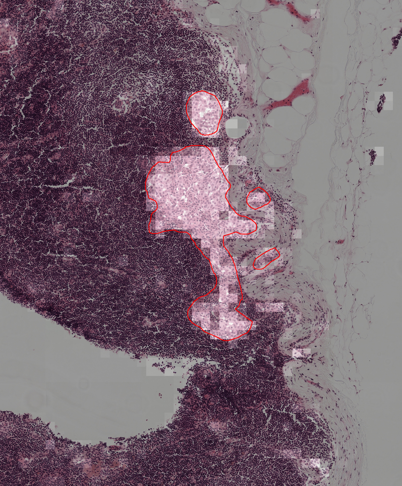
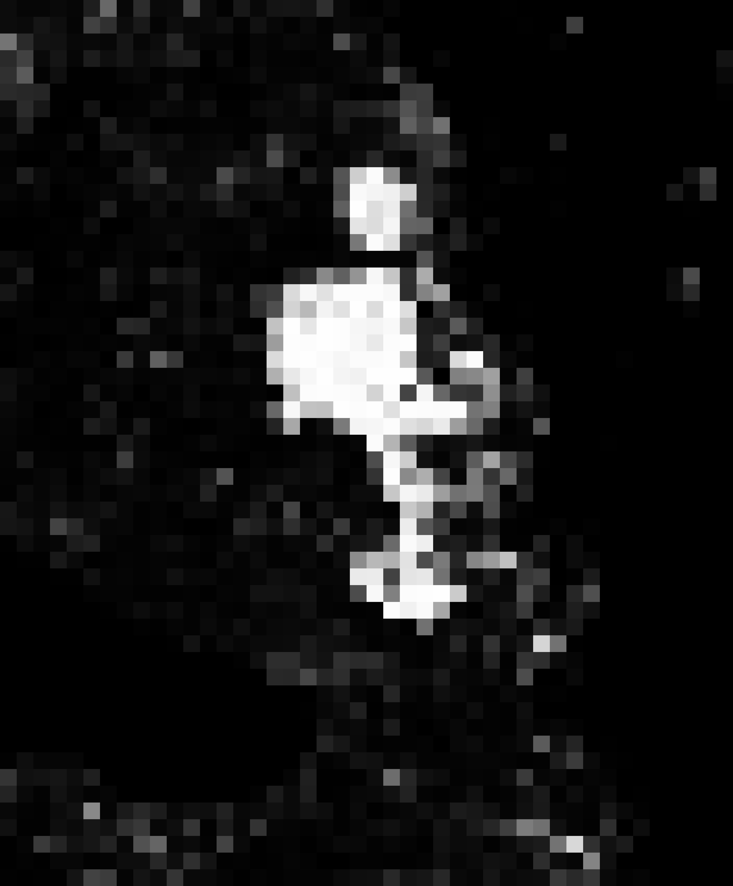

# Classification et segmentation binaire de patches WSI issus de Chamelyon16

Ce repository contient le code développé dans le cadre du projet de Modélisation de Systèmes de Vision.

# Débuter
Ce projet requert des librairies Python afin de fonctionner correctement.

- Installer Torch version GPU en suivant les étapes d'installation sur leur site web.
- Installer les librairies avec la commande `pip install -e requirements.txt`.

## Objectif du projet

Développer un pipeline de classification binaire de patches issus de Whole Slide Images (WSI), extraits du dataset *Camelyon16*, en exploitant des modèles de vision pré-entraînés pour générer des embeddings. Deux approches distinctes sont mises en œuvre, chacune utilisant un MLP (perceptron multicouche) entraîné sur ces représentations pour distinguer les classes *tissu_sain* et *tissu_cancereux*.

## Dataset

- **Nom** : Camelyon16  
- **Lien** : http://gigadb.org/dataset/view/id/100439  
- **Contenu** : Images histopathologiques (WSI) annotées avec segmentation cancer/non-cancer  
- **WSI utilisées (entraînement/validation)** :  
  `tumor_002`, `tumor_006`, `tumor_007`, `tumor_008`, `tumor_019`, `tumor_022`, `tumor_028`, `tumor_030`, `tumor_040`, `tumor_041`, `tumor_042`, `tumor_043`, `tumor_044`, `tumor_045`, `tumor_046`, `tumor_047`, `tumor_048`, `tumor_049`, `tumor_050`, `tumor_067`, `tumor_111`  
- **WSI de test final** : `tumor_001`, `tumor_005`

### Prétraitement

- Découpage des WSI en patches de taille 128x128, stride = 128.
- Filtrage automatique des patches majoritairement blancs :  
  - **Seuil de blancheur** : 230  
  - **Ratio blanc** : 80%  
- Résultats post-filtrage :  
  - 161 532 patches *cancer*  
  - 54 156 patches *non-cancer*  
- Équilibrage : sous-échantillonnage à 54 156 patches par classe.

## Méthodologie

### 1. Génération d'embeddings

- Le modéle UNI à été utilisé : https://github.com/mahmoodlab/UNI.
- Extraction des embeddings sans fine-tuning.
- Résultat : Dataset final = embeddings de dimension fixe pour 54 156 patches par classe.

### 2. Classification par MLP

- **Architecture** : MLP simple servant de *linear probe*.
- Objectif : Évaluer la séparabilité des classes dans l’espace des embeddings.

#### MLP 

- Architecture :  
  - Entrée : 1024 dimensions  
  - FC → ReLU → Dropout → FC → RELU → Dropout → FC → Sigmoid  

## Résultats

Dataset filtré:
- Accuracy : 83.6%
- Precision : 75.3%
- Recall : 92.7 %
- F1 score : 83.1%

Dataset non filtré:

- Accuracy : 83.3%
- Precision : 46.5%
- Recall : 33.3 %
- F1 score : 38.3%

## Ressources techniques

- **Langage** : Python  
- **Librairies** : PyTorch, NumPy, OpenCV, scikit-learn  
- **Infrastructure** : GPU local (RTX 4060 Laptop)

## Organisation du projet

- `patchExtract.ipynb` : Extrait des patches à partir d’images WSI (Whole Slide Images).
- `transfert.py` : Réorganise les patches extraits en deux classes distinctes pour constituer un dataset binaire.
- `filter_white_images.py` : Élimine les patches contenant majoritairement du fond blanc.
- `extract_subset_dataset.py` : Génère un sous-échantillon de la dataset initiale.
- `mirror_dataset_to_embeddings.py` : Utilise le modèle UNI pour encoder chaque patch en vecteur d'embedding, créant une version vectorisée de la dataset.
- `train_mlp_from_embeddings.py` : Entraîne un MLP sur les embeddings, puis évalue ses performances sur un jeu de test.
- `inference_heatmap.py` : Effectue l'inférence sur une WSI complète et enregistre les cartes de chaleur produites.

## Exemples d'inférence
Le contour rouge désigne la vérité terrain (tumeur), la carte de chaleur produite est superposé sur la WSI:

La carte de chaleur:

## Problèmes rencontrés

- **Déséquilibre des classes** : corrigé par sous-échantillonnage
- **Patches blancs inutiles** : filtrage par seuil

